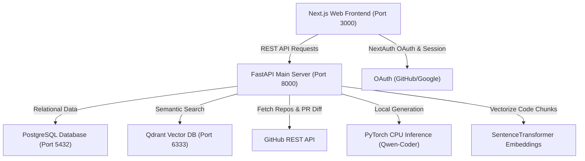

# knowDev AI - Project Audit Report

This report presents a comprehensive technical audit of the **knowDev AI** codebase (also referred to as *CodePilot AI* in historical backend contexts). It details the current architectural state, analyzes each subsystem, and identifies critical bugs, security vulnerabilities, performance bottlenecks, and refactoring opportunities.

---

## 1. Architectural Overview

knowDev AI is a next-generation AI Software Engineering workspace. It is structured as a decoupled monorepo:
* **Frontend**: Next.js v16 App Router using React v19, Tailwind CSS v4, Framer Motion, and NextAuth for secure workspace sessions.
* **Backend**: FastAPI web server hosting REST APIs, a FastMCP Model Context Protocol (MCP) server, and the local AI Inference + RAG pipeline.
* **Data Layer**: PostgreSQL (primary relational database using SQLAlchemy) and Qdrant (vector database for storing semantic codebase chunk embeddings).
* **AI Engine**: Local CPU-loaded causal LLM (`Qwen/Qwen2.5-Coder-0.5B-Instruct` using Hugging Face pipelines) and text embeddings engine (`sentence-transformers/all-MiniLM-L6-v2`).

---

## 2. Component Audits

### 2.1. Frontend
* **Stack**: Next.js 16.2.9, React 19.2.4, Tailwind CSS 4, Framer Motion 12.
* **Layout**: Standard desktop sidebar with interactive dropdown to switch repositories, command palette (`Ctrl + K`), and collapsible AI Assistant sidebar.
* **State**: Auth sessions are managed via `next-auth/react`. The client-side API requests are wrapped in `apiFetch` (`frontend/lib/api.ts`) to inject JWT headers automatically.
* **Middlewares**: `frontend/middleware.ts` forces redirection of `/dashboard/:path*` to `/login` for unauthenticated sessions.

### 2.2. Backend & API
* **Stack**: FastAPI 0.110.0, Uvicorn, Pydantic v2, SQLAlchemy 2.0.
* **Router Modules**:
  * `/api/auth`: Returns current session details.
  * `/api/chat`: Handles contextual RAG chats and stores message history in PostgreSQL.
  * `/api/repo`: Registers, indexes, and lists git repositories.
  * `/api/pr`: Triggers heuristic and AI reviews on pull request diffs.
  * `/api/docs`: Generates README, API reference, and architecture diagrams.
  * `/api/code`: Synthesizes code, creates sprint tasks, scans packages, and returns diagrams.
  * `/api/search`: Performs raw vector searches directly on Qdrant.

### 2.3. AI & RAG Pipeline
* **Local Inference**: Caches a 0.5B Parameter model locally. If disabled or on error, switches to rule-based fallback generators.
* **RAG Flow**: 
  * Files are read from repository logs, split into character chunks, and formatted into code-aware text strings including path metadata.
  * Vector embeddings are generated with `SentenceTransformer("all-MiniLM-L6-v2")` and uploaded to the `codebase_chunks` collection in Qdrant.
  * During chat or search, the query is vectorized and compared against indexed chunks via Cosine similarity.

### 2.4. Model Context Protocol (FastMCP)
* Exposes tools to external LLM clients (such as IDE extensions) at the `/mcp` route using SSE:
  * `search_codebase`: Query RAG vectors semantically.
  * `get_repositories_metrics`: Fetch code quality and coverage.
  * `get_pr_findings`: View security and quality findings.
  * `explain_code_snippet`: Explain a code block using the local model.

### 2.5. Docker & CI/CD
* **Docker Compose**: Orchestrates PostgreSQL, Qdrant, Backend, and Frontend containers with a private network bridge (`codepilot-network`).
* **CI/CD**: Performs flake8 syntax linting, runs ESLint on frontend code, tests models/endpoints, compiles Next.js builds, and validates Docker builds.

---

## 3. Key Findings & Actionable Issues

### 3.1. Critical Bugs & Missing Dependencies
1. **Missing `sentence-transformers` Dependency**:
   * *Location*: `backend/app/services/rag.py` imports `SentenceTransformer` dynamically.
   * *Issue*: `sentence-transformers` is completely missing from `backend/requirements.txt`. Booting RAG vectorizing functions will fail with `ModuleNotFoundError` on clean installations.
   * *Resolution*: Add `sentence-transformers>=2.2.2` to `requirements.txt`.
2. **Database Integrity Constraint Leak**:
   * *Location*: `backend/app/models/repository.py`
   * *Issue*: `url` column is marked `unique=True`. If User B attempts to index a repository that User A has already indexed, User B will receive an integrity validation error on database write.
   * *Resolution*: Remove `unique=True` from `url` column, and add a composite unique constraint on `(user_id, url)`.
3. **Seeding Credentials Mismatch**:
   * *Location*: `frontend/app/api/auth/[...nextauth]/route.ts` vs. `backend/app/api/deps.py`
   * *Issue*: NextAuth logs users in as `dev@knowdev.ai` with name `knowdev_dev`. The backend development bypass expects `dev@codepilot.ai` and `codepilot_dev`. This causes the database to dynamically provision duplicate dev users.
   * *Resolution*: Standardize the development credentials across both subsystems to `dev@knowdev.ai` and `knowdev_dev`.

### 3.2. Security Vulnerabilities
1. **Hardcoded Secret Keys in Code**:
   * *Location*: NextAuth config holds default secrets in code.
   * *Issue*: Codebase leaks fallback JWT secrets.
   * *Resolution*: Ensure environment variables are strictly loaded with no insecure hardcoded fallbacks in production mode.
2. **Development Auth Bypass Risk**:
   * *Location*: `backend/app/api/deps.py`
   * *Issue*: Dev bypass is active if `ENV_MODE == "development"`. A typo in production environment variables could expose the database to anonymous authorization bypass.
   * *Resolution*: Secure bypass logic with additional safety checks (e.g. check for localhost or explicit mock flag).

### 3.3. Performance Bottlenecks
1. **Blocking PyTorch CPU Inference**:
   * *Location*: `backend/app/services/ai.py`
   * *Issue*: Sentence Transformers and Qwen Causal LM run on CPU and are executed synchronously during request cycles. This blocks the single-threaded asyncio loop in FastAPI.
   * *Resolution*: Move inference loops to separate execution threads using `run_in_executor`.
2. **Suboptimal Text Chunking**:
   * *Location*: `backend/app/services/rag.py`
   * *Issue*: Code is split by raw character index limits (`chunk_size = 1000`), slicing code constructs (functions, classes) in half.
   * *Resolution*: Transition chunking to line-aware or syntax-aware divisions.

---

## 4. Refactoring & Code Quality Opportunities
* **Unify Branding**: Clean up residual "CodePilot" names in backend, SQL tables, and CLI logs to present a unified "knowDev AI" brand.
* **Prune Workspace**:
  * Remove temporary directory `qdrant_test` from root.
  * Prune `CLAUDE.md` and unused configs inside `frontend/`.
  * Ensure coverage files are omitted from Docker contexts via `.dockerignore`.
