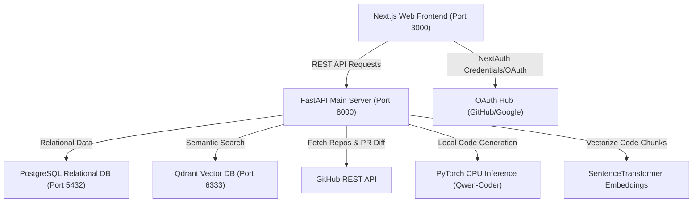

# knowDev AI

[](https://opensource.org/licenses/MIT)
[](https://fastapi.tiangolo.com)
[](https://nextjs.org)
[](https://pytorch.org)
[](https://qdrant.tech)

**knowDev AI** is a premium, developer-centric, self-hosted AI Software Engineering Assistant. It analyzes codebases, generates boilerplate, performs semantic RAG search over code files, reviews pull requests, and automates technical documentation. By leveraging local CPU-optimized PyTorch models and a vector search engine, knowDev AI provides secure, offline-capable code intelligence directly in your environment.

---

## 📸 Screenshots

*Placeholders for user interface demonstrations:*

| Dashboard Console | AI Chat Console | PR Review findings |
|:---:|:---:|:---:|
| ![Dashboard Console Mockup]  | ![AI Chat Console Mockup]  | ![PR Review Mockup]  |

---

## ✨ Features

| Feature | Description | Status |
|:---|:---|:---:|
| **Repository Analysis** | Scans codebases recursively, calculates complexity, test coverage, and documentation metrics. | ✅ |
| **AI Code Generation** | Synthesizes boilerplate, API routes, and functions using local or cloud LLMs. | ✅ |
| **PR Review & Audit** | Reviews pull request diffs for SQL Injection, exposed keys, performance issues, and code smells. | ✅ |
| **Documentation Generator** | Auto-generates READMEs, API guides, and db relation structures with one click. | ✅ |
| **RAG Knowledge Base** | Chunks files and indexes them in Qdrant Vector database for context-aware developer queries. | ✅ |
| **MCP Integration** | Implements the Model Context Protocol (FastMCP) supporting external IDE clients (Cursor, Windsurf). | ✅ |
| **Interactive Console** | Implements responsive UI dashboard featuring themes, search palettes, and inline terminals. | ✅ |

---

## 🏗️ Architecture

knowDev AI follows a decoupled microservices-inspired architecture optimized for low-latency local execution.



---

## 🛠️ Tech Stack

* **Frontend**: Next.js 16.2.9, React 19.2.4, TypeScript, Tailwind CSS v4, Lucide Icons, Framer Motion.
* **Backend**: FastAPI 0.110.0, Uvicorn, SQLAlchemy 2.0, Pydantic v2, FastMCP (SSE Transport).
* **AI Engine**: PyTorch, Hugging Face Transformers (`Qwen/Qwen2.5-Coder-0.5B-Instruct`), Sentence Transformers (`all-MiniLM-L6-v2`).
* **Database**: PostgreSQL (relational storage), Qdrant (semantic vector database).
* **DevOps**: Docker, Docker Compose, GitHub Actions (CI/CD Pipeline).

---

## 📂 Folder Structure

```
.
├── .github/
│   └── workflows/
│       └── ci-cd.yml             # Github Actions CI/CD pipeline
├── backend/
│   ├── app/
│   │   ├── api/                  # API routers (auth, chat, code, docs, pr, repo, search)
│   │   ├── db/                   # Database sessions and migrations
│   │   ├── models/               # SQLAlchemy SQL models
│   │   ├── services/             # Core service logic (AI, GitHub, PR, RAG, Docs)
│   │   ├── config.py             # Environment configurations
│   │   └── mcp_server.py         # FastMCP Server definition
│   ├── tests/                    # Pytest backend test suite
│   ├── Dockerfile                # Python container setup
│   ├── main.py                   # FastAPI entrypoint
│   └── requirements.txt          # Python dependencies
├── docs/                         # Detailed architecture, API & deployment guides
├── frontend/
│   ├── app/                      # Next.js pages, layouts, and route handlers
│   ├── components/               # Shareable UI components (AISidebar, CommandPalette)
│   ├── lib/                      # Next.js helper library (API Fetch client)
│   ├── __tests__/                # Frontend unit/component jest tests
│   ├── Dockerfile                # Node container setup
│   └── package.json              # Frontend node packages
├── docker-compose.yml            # Multi-container local orchestration
└── LICENSE                       # MIT License file
```

---

## 📥 Installation

Ensure you have [Python 3.11+](https://python.org), [Node.js 20+](https://nodejs.org), and [Docker](https://docker.com) installed.

### Windows (PowerShell)
```powershell
# Clone the repository
git clone https://github.com/username/knowdev-ai.git
cd knowdev-ai

# Set up virtual environment
cd backend
python -m venv venv
.\venv\Scripts\Activate.ps1
pip install -r requirements.txt

# Set up frontend
cd ../frontend
npm install --legacy-peer-deps
```

### Linux (Bash) / macOS
```bash
# Clone the repository
git clone https://github.com/username/knowdev-ai.git
cd knowdev-ai

# Set up virtual environment
cd backend
python3 -m venv venv
source venv/bin/activate
pip install -r requirements.txt

# Set up frontend
cd ../frontend
npm install --legacy-peer-deps
```

---

## ⚙️ Environment Variables

Create `.env` inside `backend/` and `.env.local` inside `frontend/`.

### Backend Environment (`backend/.env`)
| Key | Type | Description | Default |
|:---|:---|:---|:---|
| `ENV_MODE` | String | Environment mode (`development` or `production`) | `development` |
| `DATABASE_URL` | String | Database connection string | `sqlite:///./knowdev.db` |
| `JWT_SECRET` | String | Token signing key | `knowdev_secret_12345_dev` |
| `GITHUB_TOKEN` | String | GitHub Personal Access Token (for API scans) | *None* |
| `QDRANT_HOST` | String | Qdrant client host (`memory` or hostname) | `memory` |
| `LOCAL_INFERENCE`| Boolean| Enables local PyTorch model inference | `false` |

### Frontend Environment (`frontend/.env.local`)
| Key | Type | Description | Default |
|:---|:---|:---|:---|
| `NEXTAUTH_URL` | String | Application base URL | `http://localhost:3000` |
| `NEXTAUTH_SECRET`| String | Session encryption secret | `nextauth_dev_secret_key_1234567890` |
| `JWT_SECRET` | String | Matches the backend JWT secret | `knowdev_secret_12345_dev` |

---

## 🏃 Running Locally

To run the application locally on your machine, you can launch the services either individually or using Docker Compose.

### Method A: Running Services Individually (Recommended for development)

#### 1. Start Qdrant in Memory (Default Setup)
* By default, the backend's `QDRANT_HOST` is configured to `memory`. This will boot an in-memory vector database and automatically store indexes inside `backend/qdrant_db/` on disk. No external Qdrant running instance is needed.

#### 2. Start the Backend API Server
1. Navigate to the `backend/` directory:
   ```bash
   cd backend
   ```
2. Activate your virtual environment and run the startup script:
   ```bash
   # Windows:
   .\venv\Scripts\Activate.ps1
   # Linux/macOS:
   source venv/bin/activate

   # Start the FastAPI server:
   python main.py
   ```
* The backend API server will boot on `http://127.0.0.1:8000`.
* Verify that it is running by visiting the interactive Swagger API docs at `http://127.0.0.1:8000/docs`.

#### 3. Initialize & Seed Relational Tables
In a separate terminal (with the backend virtual environment active), run the database seeder to populate mock repositories, users, and PR reviews:
```bash
cd backend
python app/db/seed.py
```

#### 4. Start the Frontend UI Console
1. Navigate to the `frontend/` directory:
   ```bash
   cd frontend
   ```
2. Launch the Next.js development server:
   ```bash
   npm run dev
   ```
* The Next.js web application interface will start on `http://localhost:3000`.
* Open `http://localhost:3000` in your web browser.
* **Authentication Bypass**: At the login screen, enter `developer` in the Username input field (the Password field can be left blank or set to any value) and click **Sign In with Development Mode** to enter the workspace dashboard.

---

### Method B: Launching the Entire Stack via Docker Compose
To compile and orchestrate PostgreSQL, Qdrant Server, Backend API, and Next.js Frontend together:

1. Spin up the containers:
   ```bash
   docker-compose up --build
   ```
2. Once the build completes, the services are available at:
   * **Frontend UI Dashboard**: `http://localhost:3000`
   * **Backend REST API / Docs**: `http://localhost:8000/docs`
   * **Qdrant Dashboard Console**: `http://localhost:6333/dashboard`
3. Stop the containers:
   ```bash
   docker-compose down -v
   ```

---

## 🐳 Docker Setup

Spin up the entire stack (PostgreSQL, Qdrant, Backend, and Frontend) in seconds:

```bash
# Build and run all services
docker-compose up --build

# Run in background (detached mode)
docker-compose up -d

# Stop and remove all volumes
docker-compose down -v
```

---

## 🔌 API Documentation

Detailed Swagger UI documentation is available at `/docs` when running the server. Key endpoints:

* **Authentication**:
  * `GET /api/auth/me` - Fetch authenticated user details.
* **Repositories**:
  * `POST /api/repo/analyze` - Perform metadata scans and analyze code health.
  * `POST /api/repo/index` - Chunk repository files and push vector index to Qdrant.
  * `GET /api/repo/list` - List registered repositories for the current user.
* **AI Chat**:
  * `POST /api/chat` - Interact with the assistant using RAG contextual prompts.
  * `GET /api/chat/history` - Fetch user message logs.
* **PR Review**:
  * `POST /api/pr/review` - Review a GitHub PR URL and save findings.
  * `GET /api/pr/review` - Fetch review list for a specific PR URL.
* **Developer Tools**:
  * `POST /api/code/generate` - Generate source code scripts.
  * `POST /api/code/commit-message` - Generate a semantic commit message from a git diff.
  * `POST /api/code/sprint-plan` - Structure sprint roadmaps and estimations.
  * `POST /api/code/scan-dependencies` - Scan dependencies list for known vulnerabilities.
  * `POST /api/code/architecture` - Generate a Mermaid architecture diagram block.

---

## 🧠 RAG Pipeline

knowDev AI integrates a custom, high-speed Retrieval-Augmented Generation (RAG) pipeline to contextualize AI responses with your codebase:

1. **Repository Indexing**: Code files are fetched and split into manageable character units (default `1000` character chunks with `150` characters overlap).
2. **Context Injection**: Each chunk is prepended with path header context `File: <file_path>\nChunk: <chunk_index>`.
3. **Embedding Generation**: Vector embeddings are calculated via the local SentenceTransformer model `all-MiniLM-L6-v2` (dimension size 384).
4. **Vector Storage**: Embeddings are upserted into Qdrant in batches, filtered and queried using Cosine similarity.
5. **Contextual Generation**: When you query the AI, the engine retrieves matching code snippets and merges them into the system prompt before passing them to the causal LLM.

---

## 🔌 Model Context Protocol (MCP) Integration

knowDev AI implements an active **Model Context Protocol (FastMCP)** server running on SSE transport at `http://127.0.0.1:8000/mcp`. You can connect external IDEs (like Cursor, Windsurf, or VS Code MCP Extensions) to leverage codebase metrics:

### Config for Cursor IDE (`~/.codeium/config.json` or Cursor Settings):
Add a new MCP server:
* **Name**: knowDev AI
* **Type**: `sse`
* **URL**: `http://127.0.0.1:8000/mcp/sse`

---

## 🔒 Security Considerations

* **Local Inference**: All model inference (code generation and embeddings) can run entirely local on CPU to prevent codebase leaks to external API providers.
* **Token Storage**: Credentials and tokens (like `GITHUB_TOKEN` and JWT signing keys) must be managed in backend environment files (`.env`) and never exposed in frontend files.
* **Parameterized Queries**: Relational database operations utilize SQLAlchemy ORM parameterized structures to prevent SQL Injection.
* **API Routing Isolation**: All dashboard paths are protected by NextAuth middleware, enforcing active session validations.

---

## 🧪 Testing

### Backend Unit Tests
Run the pytest test suite to verify endpoints and database models:
```bash
cd backend
pytest tests/
```

### Frontend Unit & E2E Tests
Run component unit tests and playwright integration tests:
```bash
cd frontend
# Run Jest Unit Tests
npm run test
# Run Playwright E2E Tests
npm run test:e2e
```

---

## 🗺️ Future Roadmap

* [ ] **Multi-Model Support**: Support integrations for external LLM API providers (OpenAI, Anthropic, Gemini).
* [ ] **Automated Fix Execution**: Allow the AI to directly commit proposed code changes and refactoring PR findings.
* [ ] **Agentic Pipelines**: Build autonomous agents capable of resolving GitHub issues directly.
* [ ] **AST-Aware Chunking**: Improve RAG search relevance using Abstract Syntax Trees to chunk files by functional boundaries.

---

## 🤝 Contributing

Contributions are welcome! Please read the [Contributing Guide](file:///c:/Users/STAR/Documents/CodeEngine/CONTRIBUTING.md) to understand development branching, issues tracking, and style guides.

---

## 📄 License

This project is licensed under the MIT License - see the [LICENSE](file:///c:/Users/STAR/Documents/CodeEngine/LICENSE) file for details.
