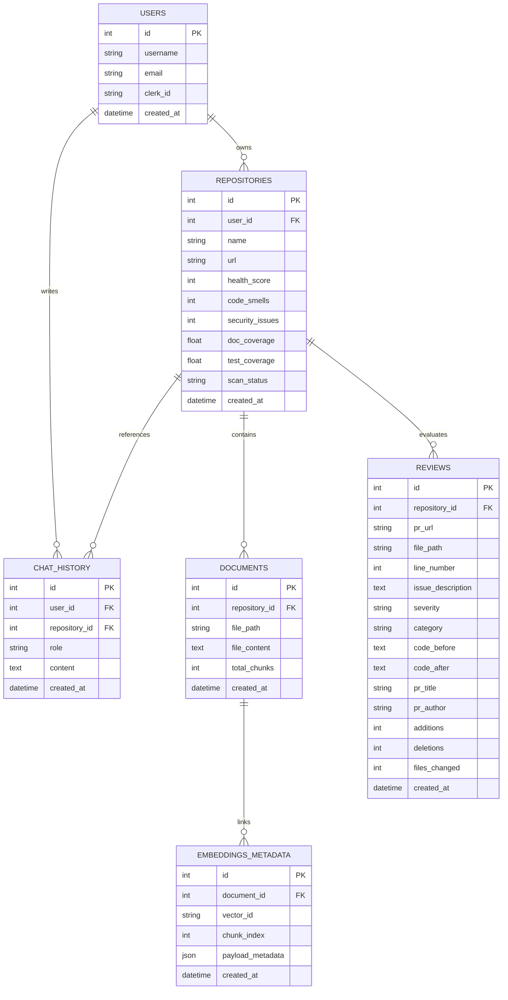

# Architecture Specification - knowDev AI

This document provides a deep dive into the system design, components, database schemas, and data flow sequences of the **knowDev AI** developer platform.

---

## 1. System Topology

knowDev AI is built as a split-process workspace client-server application, structured to facilitate both local and production server execution.

```
                  ┌───────────────────────────────┐
                  │      Next.js Web Client       │
                  │         (Port 3000)           │
                  └───────────────┬───────────────┘
                                  │
                       HTTP / REST & SSE / MCP
                                  │
                                  ▼
                  ┌───────────────────────────────┐
                  │      FastAPI Main Server      │
                  │         (Port 8000)           │
                  └───────────┬───────┬───────────┘
                              │       │
              Relational SQL  │       │  Cosine Vector Search
                              ▼       ▼
      ┌─────────────────────────┐   ┌─────────────────────────┐
      │       PostgreSQL        │   │         Qdrant          │
      │   (SQLite in local)     │   │   (Memory in local)     │
      └─────────────────────────┘   └─────────────────────────┘
```

---

## 2. Core Subsystems

### 2.1. Frontend UI (Next.js & React 19)
* **Design Philosophy**: High-fidelity dark mode interface with glassmorphism panels, utilizing CSS variables mapped to Tailwind v4 theme configurations.
* **Session Handler**: Integrates NextAuth with token interceptors. When a session is loaded, a custom JWT token is signed using the shared `JWT_SECRET` and injected into the custom `apiFetch` client headers for backend request authentication.
* **Features**:
  * **Dashboard Console**: Displays repository metrics (health, test coverage, doc coverage, code smells) with a custom SVG sparkline history.
  * **Chat Console**: Multi-turn dialog screen showing RAG-retrieved code blocks.
  * **PR Review Hub**: Shows changed files list and expandable diff nodes displaying before/after code fixes.
  * **MCP Connect Drawer**: Config controls for Cursor/Windsurf integrations.

### 2.2. Backend API (FastAPI)
* **FastAPI Router Nodes**: Deploys modular endpoints organized under `/api`. Each router injects database sessions (`get_db`) and validates user claims via authentication dependency injection (`get_current_user`).
* **Model Context Protocol (FastMCP)**: Implements an active Model Context Protocol SSE server, exposing internal codebase databases and metrics to external AI agents.

### 2.3. RAG & Embeddings Pipeline (Qdrant & SentenceTransformers)
* **Ingestion Logic**:
  1. The user inputs a GitHub URL. knowDev AI clones/scans the repository metadata and processes files with code extension filters (`.py`, `.ts`, `.tsx`, `.js`, etc.).
  2. Document records are stored in PostgreSQL/SQLite database.
  3. The `RAGService` reads document contents, breaks them into overlapping slices, and adds code-aware context tags.
  4. Slices are vectorized using `all-MiniLM-L6-v2` and pushed to the `codebase_chunks` collection in Qdrant.
* **Retrieval Logic**:
  * On chat query execution, the input text is vectorized, and a Cosine similarity query is run against Qdrant, filtered by the active repository ID.
  * The top 2-3 matched snippets are retrieved and injected into the LLM system instructions as raw context.

### 2.4. Local AI Inference Service
* **PyTorch CPU Engine**: Loads a causal language model (`Qwen/Qwen2.5-Coder-0.5B-Instruct` or similar) locally via Hugging Face `transformers` pipeline.
* **Simulated Fallback Engine**: If CPU memories are limited or CUDA settings fail, the AI service uses built-in heuristic generators to return semantic responses, ensuring 100% offline uptime for developers.

---

## 3. Database Schema Mapping

The relational schema is configured using SQLAlchemy and auto-provisioned on server startup.



---

## 4. Key Request Data Flows

### 4.1. Repository Analysis & RAG Indexing Flow
```
Client (Next.js)            FastAPI Router            GitHub Service           RAG Service           Qdrant / Postgres
   │                              │                         │                       │                     │
   ├─► POST /api/repo/index ─────►│                         │                       │                     │
   │   (repository_url)           ├─► fetch repo files ────►│                       │                     │
   │                              │   & analyze metrics     │                       │                     │
   │                              │◄── returns file lists ──┤                       │                     │
   │                              │                                                 │                     │
   │                              ├─► save repository & file documents ──────────────────────────────────►│
   │                              │                                                 │                     │
   │                              ├─► index documents ─────────────────────────────►│                     │
   │                              │                                                 ├─► generate embeds  │
   │                              │                                                 │   & batch upsert ──►│
   │                              │                                                 │   points            │
   │                              │◄── indexing completed ──────────────────────────┤                     │
   │◄── HTTP 200 OK ──────────────┤
```

### 4.2. Contextual RAG Chat Flow
```
Client (Next.js)            FastAPI Router            RAG Service             AI Service            Qdrant / LLM
   │                              │                        │                       │                     │
   ├─► POST /api/chat ───────────►│                        │                       │                     │
   │   (query, repo_url)          ├─► search matches ─────►│                       │                     │
   │                              │   for query            ├─► query similarity ──►│                     │
   │                              │                        │◄── return vectors ────┤                     │
   │                              │◄── return snippets ────┤                       │                     │
   │                              │                                                │                     │
   │                              ├─► generate response ──────────────────────────►│                     │
   │                              │   with retrieved context                       ├─► run local model  │
   │                              │                                                │   or fallback       │
   │                              │◄── return AI response text ────────────────────┤                     │
   │◄── HTTP 200 OK ──────────────┤
```
